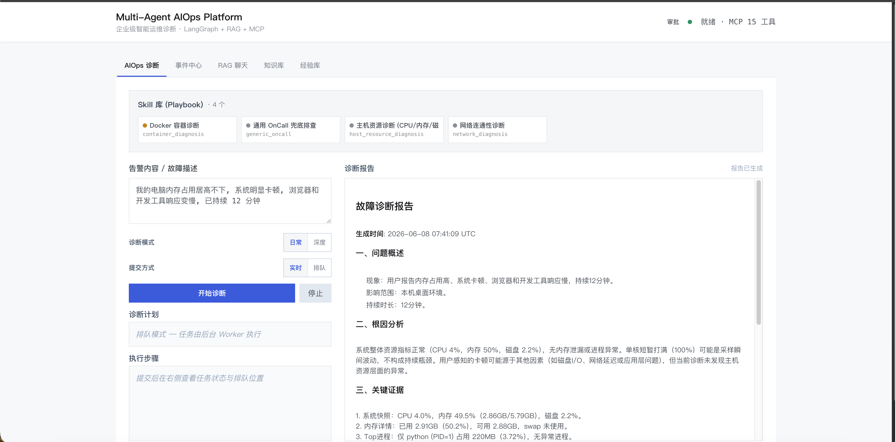
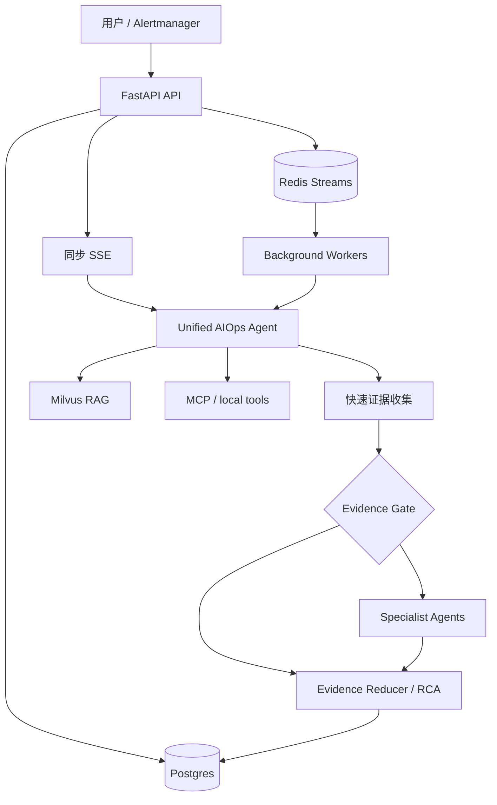

# Multi-Agent AIOps Platform


> [!IMPORTANT]
> ### 学习内容与项目状态
>
> 这是我在学习 Agent 开发过程中整理的入门项目，主要用于个人学习、实践和记录。通过本项目，
> 你可以了解以下基础内容：
>
> - 基础的 **Agent Workflow**：理解任务如何规划、执行、重新规划并生成结果。
> - 基础的 **RAG**：理解知识如何导入、检索、融合并作为上下文提供给模型。
> - 简单的 **Skills 用法与路由选择**：根据任务选择合适的 Skill，并使用对应的 Playbook 和工具。
> - **Skills 渐进式披露**：路由阶段只提供各 Skill 的名称和用途，命中后再加入完整 Playbook
>   和工具约束，减少无关上下文。
> - 多 Agent 协作、工具调用、证据汇总与诊断报告生成的基本流程。
>
> 本项目是我的阶段性学习成果，仅适合学习和入门参考，不建议直接用于生产环境。
> 当前实现以 `app/workflows/` 为统一入口，Postgres 保存工作流、事故、证据、人工决策、
> Memory、画像、成败经验和评测样本；Redis 只承担队列、租约之外的短期协调与会话缓存。

---

面向 OnCall / SRE 场景的多智能体诊断工作台。系统把用户故障描述或 Alertmanager 告警转换为
结构化任务，选择对应 Skill，通过 RAG 与 MCP 工具收集证据，并输出可追溯的 Markdown 报告。

平台通过统一 Capability Planner 组合知识问答、系统状态、一键巡检、故障诊断、只读优化、
容量性能分析和事故复盘。故障排查先收集最小证据，Evidence Gate 不满足时自动启动隔离的
Specialist Agent 协作，并把全过程事实写入 Postgres。

[项目视频](https://www.bilibili.com/video/BV182RCBGEod/)



## 核心能力

| 能力 | 当前实现 |
| --- | --- |
| 统一 Capability Workflow | Query 理解 → Scope → Capability/Skill/Tool → Evidence → Outcome |
| 运维知识问答 | 复用 RAG，只写 reference Evidence，不冒充现场状态 |
| 状态查询与一键巡检 | 结构化 CPU/内存/磁盘/进程快照、阈值判断与 ToolCall 审计 |
| 自适应故障诊断 | 快速取证后通过 Evidence Gate 决定是否启动 Specialist 多智能体协作 |
| 只读优化助手 | 基于快照生成优化建议、风险和人工确认要求，不执行任何变更 |
| 容量与性能分析 | 计算当前 Headroom；缺历史序列时禁止伪造容量预测 |
| 持久化事故闭环 | 根因/计划确认 → 新快照验证恢复 → 事务关闭 → Memory/画像/经验/评测样本沉淀 |
| Skill-first 诊断 | 按主机、网络、容器、数据库/缓存、应用运行时、消息队列或通用 OnCall Playbook 收窄工具范围 |
| 后台任务链路 | API 快速落库和入队，多个 Worker 通过 Redis Streams 后台消费 |
| 事实与证据审计 | Postgres 保存 Workflow、Incident、Event、Decision、AgentRun、ToolCall、Evidence 和学习记录 |
| RAG 检索 | Parent-Child 切分、Milvus 向量召回、BM25、RRF 融合和可选 Rerank |
| MCP 工具 | 系统、联网搜索、Windows 日志、网络和 Docker 工具独立运行 |
| 权限边界 | PermissionMode、ToolMeta、Guardrail 和人工审批共同约束副作用 |
| 可量化验证 | 990 条分层 Benchmark、配对 Memory 消融、并发测试脚本和历史压测报告 |

## 架构概览



Specialist 层包含 MetricAgent、LogAgent、InfraAgent 和 RunbookAgent。Agent 之间不共享中间推理，
只把压缩后的 Evidence 写回统一状态。完整实现和边界见[系统架构](docs/ARCHITECTURE.md)。

## 快速开始

### 1. 前置条件

- Docker 与 Docker Compose
- Python 3.12（与 `Dockerfile` 保持一致）
- 一个可用的 Chat Model Provider，例如 DeepSeek 或 DashScope
- 一个可用的 Embedding Provider：默认示例使用 Ollama + `bge-m3`，也可以改用 DashScope

### 2. 获取代码与安装依赖

```bash
git clone https://github.com/e-ntropy/aiops1.0.git
cd aiops1.0

python3.12 -m venv .venv
source .venv/bin/activate
pip install -r requirements.txt
cp .env.example .env
```

Windows PowerShell 激活虚拟环境：

```powershell
.\.venv\Scripts\Activate.ps1
```

### 3. 配置 Provider

编辑 `.env`，至少完成以下配置：

- Chat Model 名称与 API Key 使用同一个 Provider。
- 使用本地 Embedding 时，先运行 `ollama pull bge-m3`。
- 使用 DashScope Embedding 时，将 `EMBEDDING_PROVIDER` 改为 `dashscope` 并配置
  `DASHSCOPE_API_KEY`。
- 将 `KB_ADMIN_TOKEN` 改成仅自己知道的值。

项目会根据模型名称选择 Chat Provider：以 `deepseek` 开头的模型使用 `DEEPSEEK_API_KEY`，
其他示例模型使用 DashScope 配置。不要把真实 Key 提交到 Git。

### 4. 启动基础设施

```bash
docker compose up -d
docker compose ps
```

这会启动 Milvus、Redis、Postgres、Attu 和 open-webSearch，以及 Milvus 依赖的 etcd 与 MinIO。

### 5. 导入知识库

先检查待导入内容，再执行重建：

```bash
python scripts/ingest_kb_corpus.py --dry-run
python scripts/ingest_kb_corpus.py --reset --batch 8
```

默认公开语料包含 954 条 Prometheus 告警文档和通用/Redis/MySQL OnCall SOP。
`scripts/convert_log_templates.py` 可从用户自行准备的 loghub-2.0 数据生成额外日志模板；
默认仓库不包含这些模板。

### 6. 启动应用

推荐使用完整容器栈：

```bash
docker compose --profile app up -d --build
docker compose --profile app logs -f api worker-1
```

macOS / Linux 也可以使用容器基础设施加本地 Python 进程：

```bash
bash scripts/run_all.sh
```

Windows 完整拓扑建议使用 Compose `app` Profile。`run.ps1` 是本地兼容入口，
不会启动完整的 Postgres/后台 Worker 拓扑。

停止服务：

```bash
docker compose --profile app down
```

使用本地脚本启动时：

```bash
bash scripts/stop_all.sh --infra
```

### 7. 检查就绪状态

```bash
curl -fsS http://localhost:9900/api/v1/health/ready
```

## 访问入口

| 页面或接口 | 地址 |
| --- | --- |
| Web UI | <http://localhost:9900> |
| Swagger | <http://localhost:9900/docs> |
| ReDoc | <http://localhost:9900/redoc> |
| 健康检查 | <http://localhost:9900/api/v1/health> |
| 就绪检查 | <http://localhost:9900/api/v1/health/ready> |
| 队列状态 | <http://localhost:9900/api/v1/queue/status> |
| Attu Milvus UI | <http://localhost:8000> |

## 使用示例

本机资源诊断：

```text
我电脑很卡，帮我检查 CPU、内存、磁盘和高占用进程。
```

复杂告警诊断：

```text
Redis 实例 redis-master-01 内存使用率 98%，客户端连接被强制断开，请排查根因并交叉取证。
```

模拟 Alertmanager Webhook：

```bash
python scripts/mock_alert.py --scenario redis
python scripts/mock_alert.py --list-history
```

压测命令可能创建真实任务或调用 LLM。先阅读[并发测试指南](docs/CONCURRENCY_TEST_GUIDE.md)，
并从较小的 `--n` 开始。

## 主要 API

| 功能 | 方法 | 路径 |
| --- | --- | --- |
| 同步 SSE 诊断 | POST | `/api/v1/aiops/diagnose` |
| 后台诊断提交 | POST | `/api/v1/aiops/diagnose/submit` |
| Alertmanager Webhook | POST | `/api/v1/webhook/alertmanager` |
| 队列与 Worker 状态 | GET | `/api/v1/queue/status` |
| 诊断任务列表 | GET | `/api/v1/incidents/tasks` |
| RAG Chat | POST | `/api/v1/chat/stream` |
| 请求理解与任务拆分 | POST | `/api/v1/workflows/prepare` |
| Capability 列表 | GET | `/api/v1/workflows/capabilities` |
| 二次确认 | POST | `/api/v1/workflows/clarify` |
| 统一能力执行（SSE） | POST | `/api/v1/workflows/execute/stream` |
| 读取持久化状态 | GET | `/api/v1/workflows/{run_id}` |
| 读取审计事件 | GET | `/api/v1/workflows/{run_id}/events` |
| 初始化事故闭环 | POST | `/api/v1/workflows/lifecycle/initialize` |
| 人工确认诊断 | POST | `/api/v1/workflows/lifecycle/confirm-diagnosis` |
| 人工确认只读计划 | POST | `/api/v1/workflows/lifecycle/confirm-plan` |
| 恢复验证 | POST | `/api/v1/workflows/lifecycle/verify-recovery` |
| 脱敏关闭事故 | POST | `/api/v1/workflows/lifecycle/close` |
| Skill 列表 | GET | `/api/v1/skills` |
| 上传知识文档 | POST | `/api/v1/documents/upload` |
| 就绪检查 | GET | `/api/v1/health/ready` |

知识库上传和删除需要请求头：

```http
X-KB-Admin-Token: your-admin-token
```

完整请求结构以运行中的 OpenAPI 文档为准。

统一工作流采用服务端状态所有权：先把 Query 提交给 `prepare`，取得 `run_id`、`revision` 和
规划结果；后续澄清、执行和生命周期操作只提交 `run_id + expected_revision`。结果包含结构化
系统快照、阈值发现、Top 进程、ToolCall 执行状态、
带 Scope 的 Evidence 和下一步建议。接口只读，不采集进程命令行或环境变量，也不会自动结束进程。
`assess-evidence` 再依据现场证据数量、来源多样性、错误比例、Scope 一致性、异常信号和根因
置信度，确定性返回 `complete / collect_more / escalate_deep / blocked`；其中
`escalate_deep` 是兼容保留的内部状态值，对外含义是启动专业 Agent 协作。升级时保留同一 Run
的已有 Evidence，并将其直接传给 Specialist Agent。

推荐入口是先向 `prepare` 提交原始 Query；若返回 `clarifying`，通过 `clarify` 补齐目标；状态为
`ready` 后使用 `run_id + expected_revision` 调用 `execute/stream`。数据库执行租约阻止同一 Run
被并行执行，前端无需选择内部 Agent。

实时故障诊断完成后，Web UI 会显示事故闭环面板。根因和计划必须人工确认；恢复状态由同一
`TargetScope` 的新结构化快照与诊断基线比较得出，采集失败时结果为 `inconclusive`，不会根据
报告文字宣称恢复。关闭前需要人工提供脱敏描述，之后才生成评测样本并把经验晋升为
`verified_knowledge`，同时沉淀成功经验、实体画像和隔离评测样本。

`/aiops/diagnose/submit` 队列继续服务告警后台诊断。统一工作流尚未直接入队：本机 Scope
必须绑定目标节点，普通 Worker 会检查到自身容器。`background-eligibility` 会在目标 Agent、
事实持久化和 Capability Worker 适配器完成前关闭式拒绝提交。

## 项目结构

```text
.
├── app/
│   ├── agents/              # Triage 节点和 Specialist Agent
│   ├── api/                 # FastAPI 路由
│   ├── diagnosis_graphs/    # Specialist 证据协作图
│   ├── orchestration/       # 诊断执行与审计
│   ├── runtime/             # Harness、权限、审批和工具编排
│   ├── skills/              # Skill 注册表与 Playbook
│   ├── incidents/           # 事件与任务事实
│   ├── queue/               # Redis Streams
│   └── core/                # LLM、Milvus、Embedding、Rerank 等基础能力
├── benchmark/               # 工作流契约、检索、RAG 与诊断评测
├── data/kb_corpus/          # 公开 RAG 语料
├── docs/                    # 架构、并发验证、压测和 SOP
├── frontend/                # Web UI
├── mcp_servers/             # MCP 工具服务
├── open-webSearch-main/     # 第三方本地搜索服务
└── scripts/                 # 启动、导入、告警模拟与压测脚本
```

## 文档导航

- [系统架构与已知限制](docs/ARCHITECTURE.md)
- [项目技术学习手册](docs/PROJECT_TECHNICAL_LEARNING.md)
- [简历项目介绍与面试问答](docs/RESUME_INTERVIEW_GUIDE.md)
- [2026-08-10 重构方案、流程与成果](docs/REFACTOR_20260810_SUMMARY.md)
- [重构 STAR 问题与结果日志](docs/REFACTOR_STAR_LOG.md)
- [Skill 层与扩展方式](app/skills/README.md)
- [Benchmark 使用说明](benchmark/README.md)
- [AIOps 分层评测策略](docs/EVALUATION_STRATEGY.md)
- [并发与队列测试指南](docs/CONCURRENCY_TEST_GUIDE.md)
- [历史压测报告](docs/PRESSURE_TEST_REPORT.md)
- [Redis On-Call SOP](docs/sop/redis_oncall_sop.md)
- [MySQL On-Call SOP](docs/sop/mysql_oncall_sop.md)
- [通用告警处理手册](docs/sop/common_alerts.md)
- [AI 编码 Agent 仓库规则](AGENTS.zh-CN.md)

历史压测数据只代表报告记录的机器、配置和时间点，不是其他部署环境的性能保证。

无需 Provider 或基础设施即可运行统一工作流安全回归：

```bash
python benchmark/run_benchmark.py workflow
python benchmark/run_benchmark.py workflow --enforce
python benchmark/run_benchmark.py fixture --enforce
python benchmark/run_benchmark.py memory --enforce
python benchmark/run_benchmark.py tool --enforce
python benchmark/validate_scaled_benchmarks.py
```

## 数据、安全与费用

- 不提交 `.env`、API Key、真实私有端点、数据库卷、日志或运行时 Wiki。
- MCP system/network/docker 工具可能读取宿主机或网络信息；只在授权环境中运行。
- Docker MCP 包含受控重启能力，高风险工具默认阻断，不应使用 `PERMISSION_MODE=bypass`
  暴露到公网。
- `ragas`、真实诊断、远程 Embedding、Rerank 和联网搜索可能产生费用或发送数据到外部服务。
- 当前 CORS 允许所有来源，适合本地演示；生产部署必须增加身份认证、来源限制和反向代理策略。

运行时 API 版本仍由 `.env` 中的 `APP_VERSION` 独立配置。

## License 与来源

本项目代码以 [MIT License](LICENSE) 发布。

仓库包含或参考以下第三方资产，其许可证分别生效：

- [Aas-ee/open-webSearch](https://github.com/Aas-ee/open-webSearch)：本地联网搜索服务，仓库副本位于
  `open-webSearch-main/`，采用 Apache License 2.0。
- [samber/awesome-prometheus-alerts](https://github.com/samber/awesome-prometheus-alerts)：
  Prometheus 告警语料来源，原始项目标注为 CC BY 4.0。

具体权利与义务以各项目的官方许可证原文为准。
