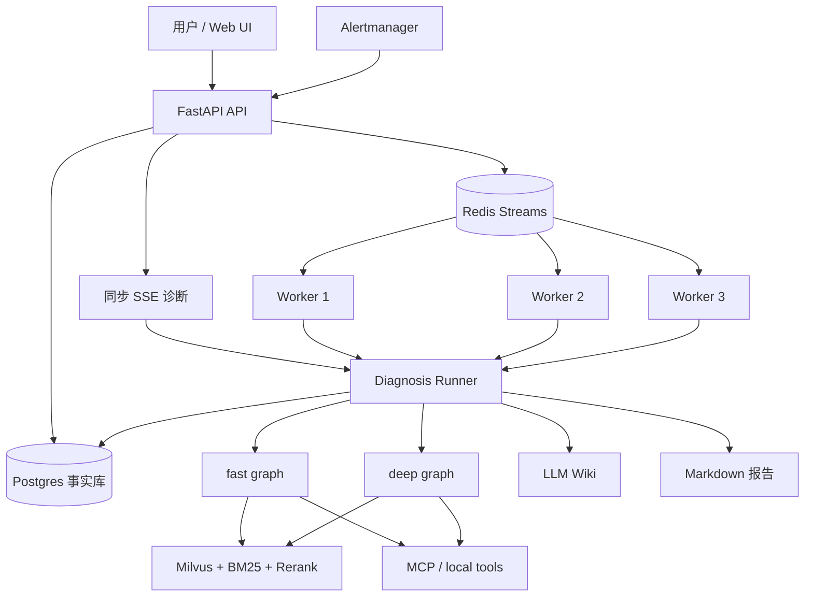

# 系统架构

本文承载无法简洁放入根级运行地图的长期架构细节，描述当前代码已经实现的架构、边界和限制。
Agent 导航和关键编辑边界由 [AGENTS.md](../AGENTS.md) 维护；用户价值、安装和快速开始由
[README](../README.md) 维护；并发验证步骤由
[并发测试指南](CONCURRENCY_TEST_GUIDE.md) 维护；历史压测结果由
[压测报告](PRESSURE_TEST_REPORT.md) 维护。架构事实变化时应在同一次修改中更新对应的信息
所有者，并通过链接引用，避免重复维护同一事实。

## 1. 系统定位

Multi-Agent AIOps Platform V3 是面向 OnCall / SRE 场景的参考实现。它把用户故障描述或
Alertmanager 告警转换为诊断任务，通过 Skill、RAG 和 MCP 工具收集证据，并输出可追溯报告。

V3 解决的是演示型 Agent 经常缺失的工程边界：

- API 接入与重诊断执行分离
- Redis Streams 队列削峰与 Worker 后台消费
- Postgres 事实记录和证据审计
- fast / deep 两条诊断图
- 全局并发槽、限流、重试与 DLQ
- 工具权限、Guardrail 和人工审批结构
- 可复现的检索评测与并发测试

它仍是个人维护的参考工程，不代表已经完成生产环境所需的认证、多租户、细粒度授权、完整测试、
高可用部署和灾备设计。

## 2. 系统上下文



### 两种接入路径

| 路径 | 入口 | 适用场景 | 执行位置 |
| --- | --- | --- | --- |
| 同步诊断 | `POST /api/v1/aiops/diagnose` | 少量即时交互，需要 SSE 过程事件 | API 进程 |
| 后台诊断 | `POST /api/v1/aiops/diagnose/submit` 或 Alertmanager Webhook | 并发、告警洪峰、需要任务历史 | Redis 队列后的 Worker |

两条路径复用 `app/orchestration/diagnosis_runner.py`，但后台路径会先把任务事实写入 Postgres，
再通过 Redis Streams 交给 Worker。

## 3. fast 诊断图

```text
Skill Router
    -> Planner
    -> Executor
    -> Replanner
    -> Report
```

### Skill Router

`app/agents/skill_router.py` 把 Skill 的名称、描述和触发词组织成菜单，请 LLM 返回结构化选择。
当 LLM 失败时，规则只负责判断输入是否属于 OnCall 范围，再回退到 `generic_oncall` 或直接结束。

### Planner / Executor / Replanner

- Planner 根据选中的 Playbook 生成诊断步骤。
- Executor 通过 `app/runtime/tool_filter.py` 和权限决策收窄工具，再执行当前步骤。
- Replanner 根据已获得证据继续、调整、切换 Skill 或结束。
- Harness 统一管理模型档位、预算、Prompt 和运行统计。

### 工具边界

Skill 的 `allowed_tools` 不是对所有查询工具的绝对白名单：

- 写入、通知和高风险工具必须由 Skill 显式声明。
- 已在 ToolMeta 中登记为只读的工具，可由运行时策略补充，降低 Skill 漏配导致模型猜测的风险。
- PermissionMode 与 Guardrail 会继续给候选工具生成 `allow / ask / deny` 决策。
- 高风险工具默认阻断；`ask_destructive` 模式可以进入人工审批。

## 4. deep 诊断图

```text
IncidentManager
    -> CorrelationContext
    -> EvidencePlan
    -> MetricAgent / LogAgent / InfraAgent / RunbookAgent
    -> EvidenceReducer
    -> RCAJudge
    -> RemediationPlanner
    -> ReportAgent
```

### 上下文和派遣

- IncidentManager 读取任务、事件组和告警元信息；手动 SSE 没有任务事实时会安全降级。
- CorrelationContext 聚合同组告警和 LLM Wiki 历史经验。
- EvidencePlan 使用确定性关键词规则决定派遣哪些专业 Agent。图结构固定为四路 fan-out，
  未被派遣的节点通过 Guard 跳过，不调用 LLM。

### 专业 Agent

| Agent | 当前数据来源 | Evidence 类型 | 当前限制 |
| --- | --- | --- | --- |
| MetricAgent | Prometheus（配置时优先）与本机系统工具 | `metric_snapshot` | 未配置 Prometheus 时只能观察运行 Agent 的本机 |
| LogAgent | 已导入 RAG 语料中的告警规则、可选日志模板和 SOP | `log_excerpt` | 不直接连接 Loki / Elasticsearch，也不读取原始日志 |
| InfraAgent | 本机系统工具及已连接的只读 Docker / Network MCP 工具 | `infra_snapshot` | 外部工具缺失时只能返回本机快照 |
| RunbookAgent | RAG 中的 SOP、Runbook 和告警处理建议 | `runbook_match` | 与 LogAgent 共用检索工具，通过 Prompt 区分关注点 |

专业 Agent 使用隔离的最小 LLM/工具循环，只把压缩 Evidence 写入共享状态，中间对话不会互相
传播。单个 Agent 失败时会返回带 `error_type` 的 Evidence，避免整张图因一个数据源失败而中断。

当前专业 Agent 使用硬编码的只读工具集合，并通过 `decisions=None` 调用并行工具运行器；它们尚未
复用 fast 链路完整的 PermissionMode 决策。这是已知限制，新增任何写工具前必须先补齐权限集成。

### 归并、RCA 与处置

- EvidenceReducer 使用确定性分数归并候选：现场指标和基础设施证据优先，知识检索作为辅助。
- RCAJudge 只读取候选摘要和 Evidence 引用，不直接吞入全部原始工具输出；LLM 失败时有确定性回退。
- RemediationPlanner 生成建议，不直接执行处置。包含写入风险的建议必须标记人工确认。
- ReportAgent 输出引用 Evidence 的结构化 Markdown 报告。

deep 图内部暂用 `ev_0` 这类内存引用关联 Evidence；后台任务的审计路径再把运行结果写入事实库。
这不是跨任务稳定的公共 Evidence ID。

## 5. RAG 链路

```text
Markdown / SOP / Alert corpus
    -> 结构化切分
    -> Parent-Child chunks
    -> child 向量写入 Milvus
    -> Vector + BM25 召回
    -> RRF 融合
    -> 可选 Rerank
    -> top-k parent context
```

默认公开语料包括 954 条 Prometheus 告警文档、通用/Redis/MySQL SOP 和评测 Runbook。
`scripts/convert_log_templates.py` 可以从用户提供的 loghub-2.0 数据额外生成日志模板，但这些模板
不随默认公开仓库分发。

检索结果和指标依赖当前语料、Embedding、Milvus Collection、Reranker、模型和运行环境。
历史结果只能作为对应配置的证据，不能视为所有部署的保证。

## 6. 事实、状态和审计

### Postgres

Postgres 保存长期事实，包括 Alert、IncidentGroup、DiagnosisTask、AgentRun、ToolCall、Evidence、
ApprovalRequest 和 Report。Schema 当前由 `app/db/postgres.py` 初始化；变更需要兼容与恢复方案。

### Redis

Redis 保存运行态队列、Consumer Group、Worker 心跳、全局并发槽、限流计数和部分会话数据。
它不是诊断事实的最终权威。

### LLM Wiki

`data/wiki/` 保存运行时经验。除 `CONVENTIONS.md` 外的内容由 `.gitignore` 排除，因为其中可能包含
真实事件信息。不能把运行时 Wiki 当作可公开提交的普通文档。

## 7. 并发和失败恢复

系统区分三种不同数量：接入请求数、排队任务数、真实执行中的诊断数。

```text
请求洪峰
    -> API 校验、落库、入队
    -> Redis Streams 按优先级缓冲
    -> Worker 领取
    -> Redis 全局执行槽限制昂贵诊断
    -> 成功 ACK / 失败重试 / 最终 DLQ
```

- 手动接口和 Webhook 使用固定窗口限流；Redis 不可用时采用 fail-open。
- Worker 心跳、Pending 回收、最大尝试次数和 DLQ 防止任务静默丢失。
- 增加 Worker 数量不会自动提高真实诊断并发；全局执行槽仍是上限。
- 同步 SSE 与后台 Worker 使用不同的全局槽，避免一种入口独占全部资源。

详细验证方式见[并发测试指南](CONCURRENCY_TEST_GUIDE.md)。

## 8. 进程与部署边界

| 进程 | 入口 | 说明 |
| --- | --- | --- |
| API | `uvicorn app.main:app` | HTTP/SSE、前端静态文件、同步诊断和任务提交 |
| Worker | `python -m app.diagnosis_worker` | 消费队列并执行后台诊断 |
| MCP system | `mcp_servers/system_server.py` | 本机系统快照 |
| MCP websearch | `mcp_servers/websearch_server.py` | 本地 open-webSearch 适配 |
| MCP winlog | `mcp_servers/winlog_server.py` | Windows 事件日志 |
| MCP network | `mcp_servers/network_server.py` | DNS、HTTP、端口和 Ping |
| MCP docker | `mcp_servers/docker_server.py` | Docker 查询与受控重启能力 |
| open-webSearch | `open-webSearch-main/` | 独立 Node.js 搜索服务 |

API 和 Worker 使用同一个 Python 镜像，通过 Compose Command 区分角色。

## 9. 已知工程限制

- 没有已提交的 `tests/`、CI Workflow、`pyproject.toml` 或统一 Formatter 配置。
- 多个核心模块仍较大，职责拆分和复杂度治理需要单独重构计划与回归证据。
- Windows `run.ps1` 不是完整 V3 后台拓扑启动器；完整部署应使用 Compose `app` Profile。
- deep 专业 Agent 尚未统一接入 fast 的 PermissionMode 决策。
- LogAgent 默认只检索知识库，不连接真实日志后端。
- CORS 当前允许全部来源，适合本地演示，不适合直接暴露到生产公网。
- 限流在 Redis 故障时 fail-open，这是可用性优先的明确取舍，不等同于安全网关。
- 缺少用户认证、多租户隔离和细粒度数据授权。
- `requirements.txt` 使用范围依赖而非完整锁文件，部署复现性受上游发布影响。

这些限制应在具体需求出现时按风险逐项处理，不能通过一次大规模“整理”静默改写。
