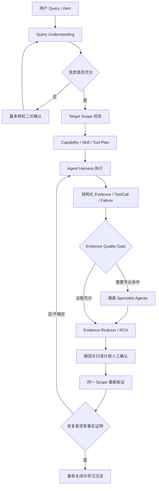
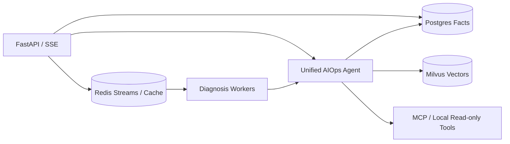

# 系统架构

## 1. 产品目标

本项目是面向 OnCall / SRE 场景的多智能体 AIOps 诊断工作台。用户可以从运维知识咨询开始，
进一步查询授权目标的真实状态；异常会进入统一故障诊断链路，形成结构化证据、根因和只读处置
计划；人工确认后重新采集同一作用域的数据验证恢复；事故关闭时把脱敏知识、画像、成败经验和
评测样本一次性沉淀。整个链路以可观察事实为完成依据，不以模型文字代替工具成功、恢复或审批。

系统是公开参考实现，不代表已经完成企业生产环境中的身份、网络、可用性和合规认证。

## 2. 统一执行链路

对外只有一个 `WorkflowState` 和一个推荐执行入口。内部的快速取证、证据门控、Metric/Log/Infra/
Runbook 专业协作是同一 Run 的不同阶段；初步证据会作为种子 Evidence 进入专业阶段，专业 Agent
只返回压缩证据，不共享私有推理上下文。

统一能力包括：知识问答、系统状态、一键巡检、自适应故障诊断、只读优化、容量性能分析、事故
复盘和评测资产摘要。知识库内容只能作为 `reference`；只有绑定已校验 `TargetScope` 的工具结果
可以标记为 `observed`。

## 3. 状态所有权与并发约束

客户端先调用 `POST /api/v1/workflows/prepare`，后续请求只提交 `run_id + expected_revision`，
不回传并覆盖完整状态。服务端从 Postgres 加载权威状态并使用 Compare-And-Swap 更新：

- `workflow_runs.state` 保存完整快照，`revision` 是乐观锁版本。
- 每次成功转换都追加 `workflow_events`，用于还原时间线。
- 执行前领取数据库 Lease；同一 Run 只能有一个未过期执行者。
- 版本不一致返回 HTTP 409，避免浏览器多标签、重试或并发请求静默覆盖。
- API 断开会尝试记录取消；可重试失败记录 attempt、fallback 和错误类别。

`WorkflowState` 还约束原始 Query、拆解任务、Scope、允许工具、预算、Evidence、Failure、Memory、
Outcome、生命周期和状态转换。现场 Evidence 没有已验证 Scope 时模型校验直接失败；非只读工具
进入统一 Capability 状态时同样直接失败。

## 4. 数据与基础设施边界

Postgres 是持久事实权威：

- `alerts / incident_groups / incidents / diagnosis_tasks`：告警、事故和后台任务。
- `workflow_runs / workflow_events`：统一状态快照、版本、Lease 与转换事件。
- `agent_runs / tool_calls / evidence / reports`：执行、工具、证据和报告审计。
- `human_decisions / approvals`：根因、计划和其他人工决策。
- `memory_records / entity_profiles / experience_records`：记忆、画像和成败经验。
- `evaluation_samples`：事故关闭时生成、与在线召回隔离的评测样本。

Redis 负责 Streams、消费者协调、限流和短期会话缓存，不作为事故或工作流事实来源。诊断报告缓存
按 Session 哈希隔离，禁止使用全局 Key 把一位用户的机器状态注入另一位用户的 RAG 对话。
Milvus 只保存知识向量；运行时机器数据不进入公共知识语料。

## 5. Query、Skill 与 Tool 的渐进式披露

Query Understanding 先保留不可变 `raw_query`，再生成改写 Query、目标、实体、缺失信息和最多
12 个明确子任务。作用域或意图不足时进入 Clarify；达到轮次预算仍不充分则关闭式失败。

Capability Registry 先暴露能力名称与用途；路由命中后才展开候选 Skill；Skill 命中后才读取完整
Playbook 和允许工具。Tool 必须同时通过 Capability allowlist、Skill allowlist、`ToolMeta` 只读
判断、PermissionMode、Guardrail 与预算检查。高风险、副作用或通知工具不属于当前统一链路；
Docker restart 即使和只读 Docker 工具同服，也不能被整体视为只读。

工具失败采用有限重试：仅可重试错误且仍有预算时重试；达到上限后按能力降级为替代数据源、
证据不足报告或关闭式终止。副作用操作若未来接入，必须先提供幂等键或“不确定结果”恢复路径。

## 6. RAG 与证据隔离

知识库采用 Parent-Child 切分、Milvus 向量召回、BM25、RRF 融合和可选 Rerank。检索结果记录
来源并作为 `reference` Evidence，不可证明当前 CPU、内存、进程或服务状态。现场事实来自经过
Scope 校验的 MCP/本地工具，记录 observed_at、tool_call_id 和调用状态。

诊断报告的会话缓存使用 Session 派生 Key；深度关联只读取 Postgres 中 `status=verified` 且
`memory_type=verified_knowledge` 的脱敏记忆。Candidate、失败对话和运行时 Wiki 不参与默认召回，
从而隔离真实机器信息、Benchmark Mock 与知识语料。

## 7. Memory、画像与经验生命周期

读取发生在 Workflow 创建时，由服务端按 Session、Incident、Service 和 Scope 选择：

- Session Memory 只在当前会话内提供连续上下文。
- Verified Knowledge 只有人工确认根因、同 Scope 验证恢复、脱敏通过并关闭事故后才能召回。
- Entity Profile 保存操作者、服务或资源的稳定脱敏属性及关联 Memory。
- Experience 保存成功与失败路径；失败经验用于复盘，不会自动成为知识结论。

普通完成只生成 Candidate 和写入决策。事故关闭在一个数据库事务中完成：更新 Workflow、追加关闭
事件、保存人工决定、写 Verified Memory、归档 Candidate、写成功经验、更新画像、生成隔离评测
样本并关闭 Incident/Group。任一步失败都会回滚，避免出现“事故已关但知识未写”或反向情况。

长期治理依赖 `expires_at`、`superseded_by`、status 和质量分：过期、冲突或被更新的记录不进入
召回；删除应先归档/失效并保留审计，不直接把历史事实从事故链路中抹除。

## 8. 事故生命周期与 HITL

诊断完成后依次进入：

1. 人工确认或修正根因；
2. 人工确认只读处置/验证计划；
3. 重新调用同一 Scope 的只读工具；
4. 将新 Evidence 与基线比较，得到 recovered / not_recovered / inconclusive；
5. recovered 且脱敏通过后关闭事故并学习。

系统优化助手只输出建议、风险、证据引用和确认要求，不自动修改配置、终止进程或重启服务。
模型报告中的“已恢复”不会改变生命周期；只有新采集 Evidence 能完成恢复验证。

## 9. 评测与发布门槛

评测分为确定性契约、路由、检索、回答质量、诊断 Fixture、事故闭环和并发可靠性。版本化 JSONL
覆盖正常/边界、正反例、简单/复杂、作用域污染和工具失败。事故关闭生成的样本写入独立表，不能
参与同一次在线回答的召回。

在线 Agent 的评测能力只展示数据集数量和隔离样本分布，不自动启动可能付费的 Provider 调用。
离线命令和 Release Gate 见[评测策略](EVALUATION_STRATEGY.md)与
[Benchmark README](../benchmark/README.md)。历史指标必须保留环境、时间、数据集版本和命令，
不能外推为其他机器的生产性能。

## 10. 当前验证边界

- 安全基线是 Ruff、CompileAll、Compose 配置、确定性 `unittest` 和 Benchmark Fixture。
- 需要 Milvus、Postgres、Redis、MCP 或 Provider 的链路必须在服务就绪且确认费用/数据范围后验证。
- 本机 Scope 必须绑定实际执行节点；不能把任务随机分发给观察目标不同的 Worker。
- Alertmanager 后台队列已使用 Redis Streams；统一本机 Capability 在目标 Agent 适配完成前保持
  关闭式拒绝后台提交，避免 Worker 容器被误当成用户主机。
- 专业 Agent 当前只允许现有只读工具。新增任何写工具前必须完成统一权限与审批集成。
- 当前没有完整企业级认证、租户隔离、跨区域高可用或灾备承诺。
