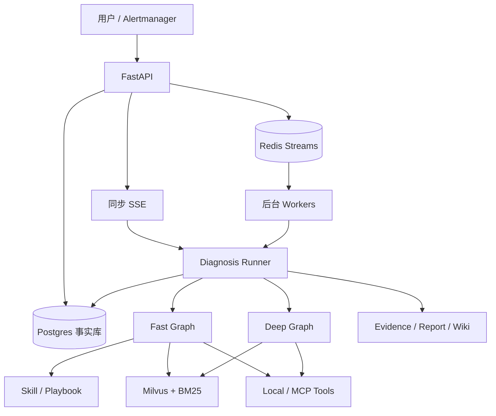
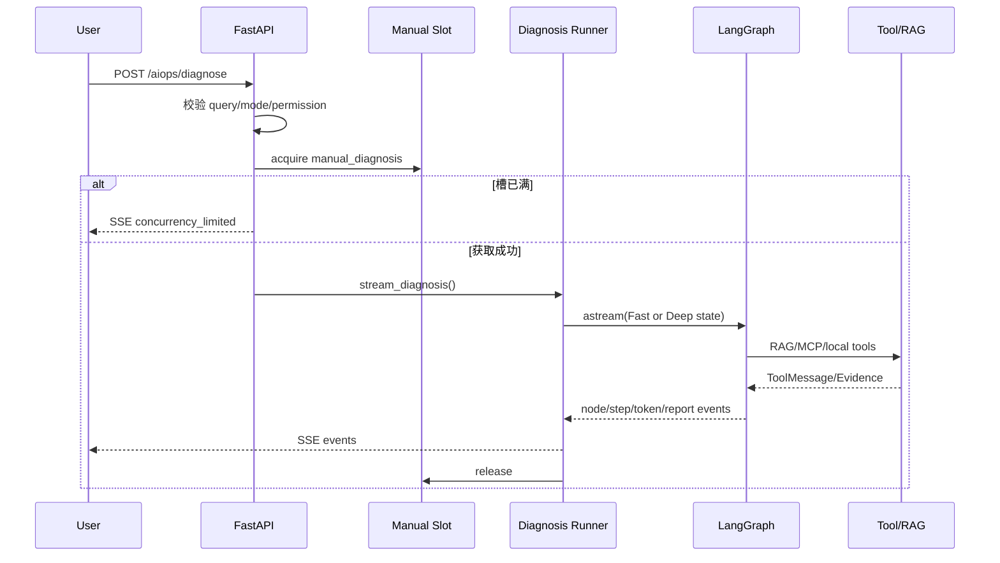
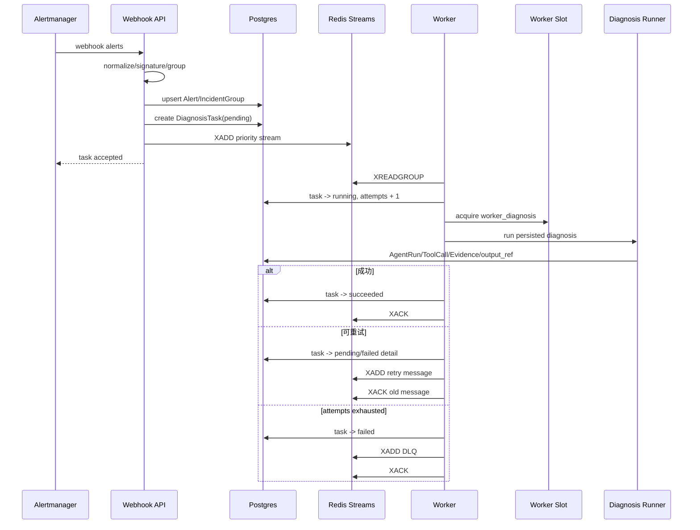

# Multi-Agent AIOps Platform V3 技术学习手册

> 目标：不是背诵项目名词，而是能够从需求、架构、关键实现、工程取舍、评测结果和已知缺陷六个层次解释项目。  
> 项目性质：面向 OnCall/SRE 的个人公开参考实现，不是生产系统，也不应包装成真实线上事故平台。  
> 推荐配套阅读：[系统架构](ARCHITECTURE.md)、[Benchmark 指南](../benchmark/README.md)、
> [最终评测报告](../benchmark/reports/FINAL_METRICS_REPORT.md)。

## 1. 一句话理解项目

系统把用户故障描述或 Alertmanager 告警转化为结构化诊断任务，通过 Skill 选择排障剧本，
再利用 RAG 和 MCP/本地工具收集证据，最后输出带证据引用的 Markdown 根因报告。

它与普通“聊天机器人 + 向量库”项目的区别在于：

1. 有明确的 AIOps/OnCall 业务语义，而不是开放域问答。
2. Agent 执行由 LangGraph 状态图约束，不依赖无限自由对话。
3. 检索只是证据来源之一，还会调用指标、主机、网络和容器工具。
4. 有后台队列、事实库、并发槽、权限与审批等工程边界。
5. 同时评估检索质量、生成质量、路由质量和最终诊断质量。

## 2. 问题域与核心需求

### 2.1 为什么 AIOps 适合 Agent

一次故障诊断通常不是单轮问答，而是一组依赖前一步结果的动作：

```text
理解现象
  -> 识别故障域
  -> 制定排查步骤
  -> 查询指标/日志/基础设施
  -> 根据新证据调整计划
  -> 判断根因
  -> 给出处置建议和风险
```

这类任务同时具备动态规划、工具调用、多数据源取证和过程审计需求，适合用状态图 Agent，
但也容易出现错误工具调用、无限循环、上下文膨胀和“有证据但归因错误”等问题。

### 2.2 本项目希望解决的五类问题

| 问题 | 典型风险 | 项目方案 |
| --- | --- | --- |
| 故障类型多 | 所有工具和提示词一次性注入 | Skill-first 渐进式披露 |
| 诊断路径不固定 | 单轮 Prompt 无法动态调整 | LangGraph Plan-Execute-Replan |
| 复杂事故证据分散 | 单 Agent 容易漏查 | Deep 专业 Agent fan-out/fan-in |
| 告警洪峰 | API 内同步执行导致阻塞 | Postgres 落事实 + Redis Streams 削峰 |
| Agent 有副作用 | 模型可能猜测或滥用工具 | ToolMeta + PermissionMode + Guardrail + 审批 |

## 3. 总体架构



### 3.1 分层职责

| 层 | 主要职责 | 代表目录 |
| --- | --- | --- |
| API | 请求校验、SSE、任务提交、Webhook | `app/api/` |
| Service/Orchestration | 用例执行、模式选择、审计 | `app/services/`、`app/orchestration/` |
| Agent Graph | Fast/Deep 图和节点 | `app/agents/`、`app/diagnosis_graphs/` |
| Runtime | Prompt、预算、工具权限、审批、流式事件 | `app/runtime/` |
| Knowledge | Embedding、Milvus、BM25、Rerank | `app/core/`、`app/rag/` |
| Fact/Queue | Postgres 事实、Redis 运行态 | `app/db/`、`app/incidents/`、`app/queue/` |
| External Tools | MCP 服务与本机工具 | `mcp_servers/`、`app/tools/` |
| Evaluation | 数据集、Runner、报告 | `benchmark/` |

关键边界是：Postgres 是长期事实权威，Redis 负责短期运行协调；模型文本不能证明工具执行成功，
必须以结构化 ToolCall/Evidence/Task 状态为准。

## 4. Fast Agent：Plan-Execute-Replan

### 4.1 图结构

```text
START
  -> SkillRouter
  -> Planner
  -> Executor
  -> Replanner
      ├─ response 已生成 -> END
      ├─ pending_reroute -> Planner
      └─ 仍有 plan -> Executor
```

源码入口：

- `app/agents/graph.py`
- `app/agents/skill_router.py`
- `app/agents/planner.py`
- `app/agents/executor.py`
- `app/agents/replanner.py`

### 4.2 为什么需要 Replanner

静态计划假定环境和工具结果都符合预期，但真实诊断中可能发生：

- 工具不可用或返回空结果；
- 当前 Skill 不适合；
- 已有证据足够提前结束；
- 新证据要求增加或删除步骤；
- 多次执行相同步骤形成循环。

Replanner 根据 `past_steps`、剩余计划、重路由次数和预算决定继续、重规划或报告。
`AgentHarness` 还提供最大步骤数、图递归上限、重路由配额和 Token/耗时预算。

### 4.3 Fast 的现实问题

完整 E2E 评测显示 Fast 平均 43.8 秒、35,991 Token，反而比 Deep 更慢、更贵。
原因不是“Fast 理论错误”，而是当前实现中 Plan/Execute/Replan 循环、重复工具调用和累计上下文
可能放大成本。因此模式名只是业务意图，不是性能保证。

## 5. Skill-first 与渐进式披露

### 5.1 Skill、Tool、RAG、Workflow 的区别

| 概念 | 含义 |
| --- | --- |
| Tool | 一个原子能力，例如查询 CPU 或知识库 |
| RAG | 一类检索工具和上下文构建流程 |
| Skill | 某类故障的 Playbook、工具范围和输出要求 |
| Workflow | LangGraph 中节点与状态转移关系 |

Skill 的价值是把排障方法从大段 System Prompt 中拆出来，形成可版本管理的领域资产。

### 5.2 渐进式披露过程

```text
Router 阶段：
  只提供 name + description + triggers

选中 Skill 后：
  加载完整 SKILL.md Playbook + allowed_tools + risk_level

Executor 阶段：
  Tool Filter 再结合 PermissionMode 得到实际可见工具
```

这样做的主要收益不是未经验证的“节省固定百分比 Token”，而是减少无关 Playbook 干扰，
并让工具范围能够与业务剧本绑定。

### 5.3 Router 判分修正

旧评测逻辑把 OOS 样本的普通非空回复也视为正确，无法证明 Router 真正执行了 OOS 决策。
修正后只有结构化 `ROUTER_OUT_OF_SCOPE` transition reason 才算 OOS；LLM 异常也计入分母。

实际 40 条结果：

| 指标 | 结果 |
| --- | ---: |
| 总体准确率 | 75.0% |
| 非 OOS Skill 准确率 | 71.4% |
| OOS | 5/5 |
| LLM 请求失败 | 0 |

OOS 样本只有 5 条，所以简历应写“本评测集 OOS 5/5”，不写“线上 OOS 100%”。

## 6. Deep Agent：专业 Agent 并行取证

### 6.1 图结构

```text
IncidentManager
  -> CorrelationContext
  -> EvidencePlan
  -> MetricAgent / LogAgent / InfraAgent / RunbookAgent
  -> EvidenceReducer
  -> RCAJudge
  -> RemediationPlanner
  -> ReportAgent
```

### 6.2 专业 Agent 的职责

| Agent | 关注点 | 输出 Evidence |
| --- | --- | --- |
| MetricAgent | Prometheus 或本机资源指标 | `metric_snapshot` |
| LogAgent | RAG 中的告警规则、日志模板、SOP | `log_excerpt` |
| InfraAgent | 系统、网络、Docker 等只读工具 | `infra_snapshot` |
| RunbookAgent | SOP、Runbook 和处置流程 | `runbook_match` |

EvidencePlan 使用确定性关键词派遣。图上的四条边固定存在，但未被派遣的节点通过 Guard 直接跳过，
不调用 LLM。

### 6.3 为什么隔离专业 Agent 上下文

如果四个 Agent 共享完整对话，会产生：

- 工具原始输出重复传播，Token 快速膨胀；
- 后执行 Agent 被前一个 Agent 的结论锚定；
- 难以判断某个结论来自哪个数据源；
- 一个 Agent 的错误推理污染整张图。

当前设计让每个 Agent 运行独立最小循环，只把 `{source, type, summary, content, metadata}`
形式的 Evidence 写入共享状态。`DeepDiagnosisState.evidences` 使用
`Annotated[List, operator.add]` 支持并行 fan-in。

### 6.4 Evidence 与 RCA

EvidenceReducer 先确定性去重和打分，RCAJudge 只读取压缩候选及 Evidence 引用，而不是所有原始
工具输出。这样可以控制上下文并保留失败回退。

但 E2E 评测揭示：结构化 Evidence 只能保证“信息来自工具”，不能保证“这个工具观察的是正确的
事故对象”。

### 6.5 本次发现的证据污染

10 条合成事故描述的是 Redis、MySQL、Kafka、Kubernetes 等目标环境，但未配置对应真实观测源时，
MetricAgent/InfraAgent 会读取运行 Agent 的 Windows 本机。评测期间本机内存约 87%–90%，
`vmmemWSL` 负载较高，Deep 因而把多种远端事故都归因成本机资源压力。

最终结果：

| 指标 | Fast | Deep |
| --- | ---: | ---: |
| 根因 Top-1 | 50.0% | 0.0% |
| 证据组覆盖 | 68.3% | 94.2% |
| 引用 ID 有效 | 0% | 100% |
| 引用正确率 | 0% | 94.2% |

这说明 Deep “取到了很多真实证据”，但证据与事故实体没有绑定。正确的后续方案是：

```text
incident_id
  -> tenant/environment/resource scope
  -> isolated metrics/logs fixture or real datasource
  -> tool query
  -> Evidence(resource_id, time_range, source)

当前重构已先落地一个可回归的隔离层：16 条自生成事故夹具通过专用离线 Runner 回放结构化
Evidence，Observed Evidence 必须绑定 fixture ID、ToolCall ID 与 Workflow Scope，并禁止本机采集来源
混入；`fixture --enforce` 的隔离与 Exact Match 当前为 16/16。它解决的是确定性流程污染门禁，尚未
把真实 Fast/Deep Agent 改造成完整的远程 Scope-aware Evidence Provider，因此历史 E2E 结论仍然有效。
```

本项目当前停止新增模块，所以该方案只能作为已识别的改进方向，不能写成已完成能力。

## 7. RAG 链路

### 7.1 数据流

```text
Markdown/SOP/Alert corpus
  -> Markdown 标题切分
  -> Parent-Child chunks
  -> child embedding 写入 Milvus
  -> Vector + BM25 候选
  -> RRF 融合
  -> 可选 Rerank
  -> 按 parent_id 去重
  -> 返回 parent_content
```

### 7.2 Parent-Child 切分

默认思路是小 child 提高 embedding 聚焦度，大 parent 保留完整语义。源码还会保护代码块、
Markdown 表格、链接和 LaTeX，避免被递归切分器从中间截断。

每个 child 记录：

- `source`
- `chapter`
- `parent_id`
- `parent_content`
- `chunk_index`

章节路径会拼到 child 内容前参与 embedding，帮助检索理解片段所属语境。

### 7.3 Hybrid Search

向量检索擅长语义相似，BM25 擅长精确字符串，例如：

- `ERR_CONN_REFUSED`
- `Seconds_Behind_Master`
- `OOMKilled`
- `connected_clients`

BM25 分数与向量距离量纲不同，项目使用 Reciprocal Rank Fusion：

```text
RRF(d) = Σ weight_i / (k + rank_i(d))
```

RRF 只依赖排名，避免先对两路异构分数做脆弱归一化。当前 BM25 是进程内索引，
适合小知识库；超过约十万 chunks 应考虑 OpenSearch/Elasticsearch 等独立稀疏检索服务。

### 7.4 Rerank 的真实状态

代码同时支持 DashScope rerank 和本地 FlagEmbedding。但本机全量评测时，
`BAAI/bge-reranker-v2-m3` 与当前 tokenizer 依赖发生兼容错误并静默降级，因此最终 50 条
RAGAS 使用 `--no-rerank`。

面试时不能说“Reranker 已带来提升”，只能说：

- 链路和降级机制已经实现；
- 当前环境发现依赖兼容问题；
- 为保证实验可比性主动关闭 rerank；
- 需要修复依赖矩阵后单独做 A/B。

### 7.5 检索与生成评测

50 条检索集结果：

| 配置 | hit@3 | MRR@3 | recall@3 |
| --- | ---: | ---: | ---: |
| Hybrid | 0.860 | 0.777 | 0.860 |
| 纯 Vector | 0.800 | 0.710 | 0.800 |

Hybrid 相对纯 Vector 的 hit@3 提升 6 个百分点。

50 条 RAGAS + OpenEvals：

| 指标 | 均值 |
| --- | ---: |
| faithfulness | 0.869 |
| answer relevancy | 0.885 |
| context precision | 0.883 |
| context recall | 0.882 |
| groundedness | 0.958 |
| helpfulness | 0.898 |

5 条 smoke test 的 faithfulness=1.0 不能代表总体，最终简历只能使用 50 条结果。

## 8. 工具运行时与安全边界

### 8.1 权限决策链

```text
Skill allowed_tools
  -> ToolMeta(read_only / risk / destructive / notification)
  -> PermissionMode
  -> Guardrail
  -> allow / ask / deny
  -> ToolRunner 二次校验
  -> 审批或执行
```

`PermissionMode` 包括 `read_only`、`normal`、`ask_destructive` 和开发用 `bypass`。
其中 `bypass` 不应出现在公网或生产建议中。

### 8.2 为什么需要二次校验

即使只把允许工具 bind 给 LLM，模型仍可能生成一个未注册工具名。因此 ToolRunner 再检查：

1. 工具是否存在于当前 `tools_by_name`；
2. PermissionDecision 是否为 allow；
3. ask 是否完成审批；
4. 高风险工具是否满足 Skill 显式声明。

这是一种“模型输出不可信”的零信任设计。

### 8.3 工具并行

ToolRunner 根据 `concurrency_safe` 把相邻工具调用分批：

- 安全查询使用 `asyncio.gather` 并行；
- 写入或非并发安全工具串行；
- 单工具失败被转成 ToolMessage，不拖垮同批调用；
- 工具输出会被压缩，避免无限进入上下文。

### 8.4 人工审批

`ask_destructive` 下，高风险调用会写入 Postgres `approval_requests` 并等待人工决策。
等待期间释放 Redis 分布式执行槽，审批完成后再重新获取，避免昂贵执行槽被“等待人点击”的任务
长期占用。

## 9. 异步任务、事实与失败恢复

### 9.1 为什么不用 API 内直接跑完整诊断

LLM、RAG 和工具调用耗时可达几十秒，告警洪峰时同步执行会耗尽 API 连接和资源。
后台路径先落 Postgres，再写 Redis Stream，由 Worker 消费。

### 9.2 Redis Streams 语义

项目支持：

- severity/priority 映射的多级 Stream；
- Consumer Group 多 Worker 消费；
- PEL 保存已投递但未 ACK 消息；
- `XAUTOCLAIM` 回收崩溃 Worker 的 stale pending；
- 最大尝试次数；
- DLQ 保存最终失败任务；
- Worker TTL heartbeat。

需要注意：Redis Streams 提供的是至少一次投递语义，不能天然保证业务恰好一次。副作用操作仍需要
幂等键或不确定结果恢复机制。

### 9.3 Postgres 事实模型

核心表包括：

- `alerts`
- `incident_groups`
- `incidents`
- `diagnosis_tasks`
- `agent_runs`
- `tool_calls`
- `evidence`
- `approval_requests`

它们构成：

```text
Alert -> IncidentGroup -> DiagnosisTask
      -> AgentRun -> ToolCall -> Evidence -> Report
                           -> ApprovalRequest
```

当前 schema 没有独立 `reports` 表。最终报告以 `diagnosis_report` 类型的 Evidence 保存，
并由 AgentRun/Task 的 output reference 关联。架构文档中把 Report 列为长期事实，是逻辑实体，
不能在面试中误答成独立数据表。

### 9.4 分布式并发槽

Worker 数量不等于真实诊断并发。历史压测中 3 个 Worker 均可领取任务，但全局
`worker_diagnosis=2/2` 使真正并行诊断始终不超过 2。

历史环境结果：

- 200 个后台提交，100 并发，100% 成功，98.3 req/s；
- 500 个 Webhook，100 并发，100% 成功，197.0 req/s；
- 40 个同源请求中 20 个成功、20 个返回 429；
- 8 个真实 Worker 任务最终全部成功，执行槽峰值 2/2。

这些是特定机器和配置下的历史证据，不是通用 SLA。

## 10. 端到端评测设计

### 10.1 为什么检索指标不够

`hit@3=0.86` 只说明某些 gold 文档进入前三，不能证明：

- Agent 选择了正确 Skill；
- 工具观察了正确资源；
- RCA 把证据解释正确；
- 报告引用了真正支持结论的 Evidence；
- Fast/Deep 的成本符合预期。

因此新增 10 条事故、每条运行 Fast/Deep，共 20 次。

### 10.2 指标定义

| 指标 | 定义 |
| --- | --- |
| Root Cause Top-1 | 根因章节覆盖所有预定义因果机制组 |
| Evidence Coverage | Evidence 覆盖 gold evidence groups 的比例 |
| Citation Validity | 引用 ID 能否映射到真实 Evidence |
| Citation Correctness | Citation Validity × 被引用 Evidence 的 gold 覆盖 |
| Latency | 单次 Graph `ainvoke` 的端到端时间 |
| Token | Provider usage 中 input + output tokens |

### 10.3 为什么要支持 checkpoint

50 条 RAGAS 耗时约 33.9 分钟，单次 E2E 也可能几十秒。无 checkpoint 时网络抖动会让前面结果全部
作废。当前实现：

- 每完成一条原子写入 checkpoint；
- run config 和数据集指纹不一致时拒绝 resume；
- 单条失败隔离，成功结果保留；
- 允许基于已保存报告重新做确定性判分。

### 10.4 评测器本身也要测试

第一次 E2E 汇总时，Fast 报告使用“二、根因分析”标题，旧正则没有抽取到章节而回退到报告前
1200 字，可能把问题描述中的 gold 关键词算入根因。修正中文序号标题并重判后，Fast Top-1
从 70% 降至 50%。

这说明评测代码也属于产品代码，需要单元测试、数据集指纹和版本化判分规则。

## 11. 本地运行资源判断

实测机器：

- Ryzen 5 5600H，6 核 12 线程；
- 15.9GB RAM；
- RTX 3050 Laptop，实际 4GB VRAM；
- Docker 中运行 Milvus、etcd、MinIO、Postgres、Redis 等。

适合：

- 本地小 Embedding；
- Milvus + Redis + Postgres；
- 10–50 条轻量 benchmark；
- 远程 Chat Model；
- 低 retention Prometheus 或 fixture 数据源。

不适合：

- 本地运行大参数 Chat LLM；
- 同时启动完整 Elasticsearch/OpenSearch 日志栈；
- 大批并发 Deep Agent；
- 大型 cross-encoder reranker 与全套基础设施长期共存。

## 12. 最重要的工程教训

1. **先定义业务终局指标。** 检索变好不等于根因诊断变好。
2. **正确引用不等于正确归因。** Evidence 必须绑定资源、时间窗和事故实体。
3. **模式名不是性能结论。** Fast/Deep 必须测延迟和 Token。
4. **降级不能静默影响实验。** Rerank 降级时应在报告配置中明确记录。
5. **评测器也会产生假阳性。** 判分逻辑必须有单元测试和版本。
6. **至少一次消费要求幂等。** 队列 ACK、重试和副作用不能混为一谈。
7. **Agent 安全不能只靠 Prompt。** 工具可见性和运行时执行都要校验。
8. **本机真实数据未必是正确数据。** “真实”首先要求与事故对象匹配。

## 13. 建议学习顺序

### 第一轮：建立全局模型

1. 阅读 `README.md` 和 `docs/ARCHITECTURE.md`。
2. 画出同步/后台两条入口。
3. 能口述 Fast 和 Deep 两张图。

### 第二轮：读核心源码

1. `app/agents/graph.py`
2. `app/diagnosis_graphs/deep_diagnosis_graph.py`
3. `app/runtime/tool_filter.py`
4. `app/runtime/tool_runner.py`
5. `app/core/vector_store.py`
6. `app/core/hybrid_retriever.py`
7. `app/rag/retrieval.py`
8. `app/queue/redis_streams.py`
9. `app/diagnosis_worker.py`

### 第三轮：理解评测

1. 阅读四个数据集的字段。
2. 手算一条 hit@k、MRR、group recall。
3. 手算一条 citation correctness。
4. 比较检索、生成、路由和诊断四层指标的因果关系。

### 第四轮：面试表达

对每个亮点按以下结构练习：

```text
业务问题
  -> 为什么常规方案不够
  -> 我的设计
  -> 关键实现
  -> 如何验证
  -> 结果
  -> 失败和边界
```

## 14. 可声明与不可声明边界

### 可以声明

- 项目具备真实 AIOps/OnCall 业务模型和可执行工具链。
- 完成 40 Router、50 Retrieval、50 RAGAS 和 10×2 E2E 评测。
- Hybrid 相比纯 Vector 的 hit@3 从 0.800 提升至 0.860。
- 全量 RAGAS faithfulness 0.869、groundedness 0.958。
- 通过 E2E 指标发现 Deep 证据污染和 Fast 成本异常。
- 项目支持 Redis Streams、Postgres 审计、权限决策和审批结构。

### 不可以声明

- “零幻觉”。
- “Deep 比 Fast 更准”。
- “Reranker 已取得正向收益”。
- “真实生产事故准确率 50%/0%”——当前是轻量合成集。
- “生产级、高可用、多租户、完整测试覆盖”。
- 已解决事故级数据隔离——当前只完成问题定位和方案设计。

## 15. 从请求到报告的完整执行时序

这一节是面试时最重要的全链路。回答任何模块问题前，先说明它在时序中的位置。

### 15.1 同步 SSE 诊断



同步路径的重点是交互体验：API 保持连接并把 step、tool、usage、report 等事件推给前端。
它不适合告警洪峰，所以与后台任务使用不同的全局并发槽。

### 15.2 Alertmanager 后台路径



顺序上必须先有 Postgres 任务事实，再进入队列。否则 Redis 写成功、数据库失败时，会出现无法审计的
“幽灵任务”。当前实现是参考工程，严格跨库一致性仍需要 outbox pattern 才能彻底解决。

### 15.3 Fast 状态流

| 节点 | 主要输入 | 主要输出 | 终止/降级 |
| --- | --- | --- | --- |
| SkillRouter | `input`、Skill menu | `selected_skill`、transition | OOS 直接 `response`；LLM 失败规则兜底 |
| Planner | input、Playbook、历史步骤 | `plan` | LLM 失败使用 fallback plan |
| Executor | plan[0]、Skill、permission | `past_steps`、tool events | 工具失败转结构化结果 |
| Replanner | plan、past_steps、budget | 新 plan、reroute 或 response | 空 plan/超预算结束 |
| Report | 在 Replanner 内形成 | Markdown response | response 非空触发 END |

### 15.4 Deep 状态流

| 节点 | 主要输入 | 主要输出 | 创新点/限制 |
| --- | --- | --- | --- |
| IncidentManager | task/group IDs | 事故上下文 transition | 手动路径无 task 时安全降级 |
| CorrelationContext | incident group、Wiki | history Evidence | 把同组告警与历史经验放入证据链 |
| EvidencePlan | incident text | agents/strategy | 规则派遣稳定便宜，但表达能力有限 |
| Specialist Agents | 各自隔离上下文 | typed Evidence | 不共享中间对话；工具作用域仍需加强 |
| EvidenceReducer | evidences | candidates/paths | 确定性去重、评分和失败回退 |
| RCAJudge | candidates、Evidence 摘要 | root cause/confidence/IDs | 不读取全部原始输出，降低上下文 |
| RemediationPlanner | RCA | read/write steps | 写操作标记人工确认，不直接执行 |
| ReportAgent | RCA、Evidence、remediation | Markdown response | 使用 `ev_N` 内存引用，非跨任务稳定 ID |

## 16. 模块级技术地图与创新思维

### 16.1 API 与接入层

**源码：** `app/api/`、`app/services/`

**关键能力：**

- 同步 SSE 与后台提交双入口；
- Alertmanager payload 归一化；
- 健康/就绪检查区分进程存活与依赖可用；
- 知识库管理入口使用管理 Token；
- 请求限流和结构化错误事件。

**设计思维：**

LLM 任务延迟高、失败类型多，API 不应只有同步 RPC。同步入口优化交互，后台入口优化吞吐和恢复；
两者复用 Diagnosis Runner，避免形成两套诊断逻辑。

**面试边界：**

当前 CORS、认证、多租户和公网安全仍是参考实现级别，不能宣称生产网关能力。

### 16.2 告警归一、签名和事件聚合

**源码：** `app/incidents/`、`app/api/v1/webhook.py`

**关键能力：**

- 把 Alertmanager 标签和注释转换为内部事件；
- 计算稳定 fingerprint/signature；
- 将相关告警聚合为 IncidentGroup；
- 相同活跃事件组限制重复 pending/running 任务。

**创新思维：**

Agent 不应该把每条告警当独立聊天。先做事件聚合，再诊断“事故”，可以减少告警风暴中的重复任务，
并为 CorrelationContext 提供同组证据。

**风险：**

签名字段过少会误合并，过多会无法合并；需要按业务服务、环境、资源和时间窗评估。

### 16.3 Diagnosis Runner

**源码：** `app/orchestration/diagnosis_runner.py`

**关键能力：**

- 根据 requested mode 选择 Fast/Deep；
- 组装初始 state；
- 管理 SSE/Worker 共用执行入口；
- 把 LangGraph event 转成产品事件；
- 连接审计、usage 和最终报告。

**创新思维：**

Runner 是应用编排边界，Graph 只负责诊断状态机。Provider、数据库和 API 细节不应散落在每个节点中，
否则难以测试和复用。

### 16.4 Skill 系统

**源码：** `app/skills/`、`app/agents/skill_router.py`

**关键能力：**

- YAML frontmatter + Markdown Playbook；
- Registry 扫描、缓存、外部目录和平台过滤；
- Router 只查看元数据；
- 命中后加载完整 Playbook；
- allowed_tools 与 risk_level 进入运行时。

**创新思维：**

Skill 是领域方法资产，而不是硬编码 Prompt。渐进式披露相当于 Agent 上下文的 lazy loading，
同时把业务方法和工具权限建立显式关系。

### 16.5 Fast Graph

**源码：** `app/agents/graph.py`、`planner.py`、`executor.py`、`replanner.py`

**关键能力：**

- 有限状态图代替自由 ReAct；
- 支持重规划与 Skill reroute；
- 空计划、预算和递归上限防循环；
- 节点异常有 fallback。

**创新思维：**

模型负责语义判断，代码负责流程不变量。`response`、`pending_reroute` 和 plan 状态决定边，
而不是让模型直接输出“下一节点名称”并无限跳转。

### 16.6 Deep Graph

**源码：** `app/diagnosis_graphs/deep_diagnosis_graph.py`、`app/agents/*_agent.py`

**关键能力：**

- 固定 fan-out/fan-in；
- 规则 EvidencePlan + dispatch guard；
- 四专业 Agent 隔离上下文；
- Evidence reducer；
- RCA/Remediation/Report 分阶段生成。

**创新思维：**

多 Agent 的价值不是角色数量，而是数据源和职责隔离。共享黑板只保存 Evidence，
避免“Agent 群聊”让推理和工具原始输出指数膨胀。

**已验证缺陷：**

没有事故级 resource scope 时，隔离上下文仍无法阻止“正确读取错误环境”的证据污染。

### 16.7 AgentHarness 与状态转移

**源码：** `app/runtime/agent_harness.py`、`app/runtime/transitions.py`

**关键能力：**

- 各节点模型和 Prompt 的集中配置；
- 最大 Token、耗时、步骤、重路由预算；
- 错误分类和 fallback；
- usage/budget event；
- 结构化 transition reason。

**创新思维：**

将横切策略从节点代码中抽离。模型选择、预算和错误处理若散落在每个 Agent，会造成配置漂移，
也无法统一观测。

### 16.8 Tool Registry、MCP 与 Lazy MCP

**源码：** `app/tools/`、`app/core/mcp_client.py`、`mcp_servers/`

**关键能力：**

- 本机系统、网络、Windows 日志、Docker、联网搜索等工具；
- MCP 服务独立进程；
- 单服务加载失败隔离；
- Lazy MCP 用元工具延迟暴露大量远端工具；
- ToolMeta 描述 read_only、risk、concurrency_safe。

**创新思维：**

工具协议和 Agent 图解耦。MCP 让外部能力独立部署，ToolMeta 则把模型不可见的安全语义交给代码。

### 16.9 权限、Guardrail 与审批

**源码：** `app/runtime/permissions.py`、`tool_filter.py`、`tool_runner.py`、
`approvals.py`

**关键能力：**

- Skill 工具范围；
- read_only/normal/ask_destructive/bypass；
- allow/ask/deny 三态；
- 未授权工具二次拒绝；
- Postgres 审批、超时和审计；
- 等待审批时释放分布式槽。

**创新思维：**

Prompt 只能指导模型，不能形成安全边界。真正的权限必须在“是否向模型暴露”和“执行前再次检查”
两处生效，并由基础设施权限提供最后一道防线。

### 16.10 工具并行调度

**源码：** `app/runtime/tool_runner.py`

**关键能力：**

- 标准化不同 Provider 的 tool calls；
- 根据 `concurrency_safe` 分批；
- 安全工具 `asyncio.gather`；
- 非安全工具串行；
- 单工具失败隔离；
- token 流式输出和 usage 上报。

**创新思维：**

不是所有工具都应该并行。查询 CPU 与磁盘可以并发，重启容器和修改配置必须串行且审批。
调度策略由 ToolMeta 决定，不能让 LLM 自己声称“这些调用安全”。

### 16.11 RAG 数据处理

**源码：** `app/core/splitter.py`、`scripts/ingest_kb_corpus.py`

**关键能力：**

- Markdown 标题分层；
- Parent-Child；
- 表格/代码/链接/公式结构保护；
- 章节前缀参与 embedding；
- 数据集指纹、批量写入、重试与 checkpoint。

**创新思维：**

知识入库不是一次脚本操作，而是可恢复的数据流水线。chunk schema、embedding model 和 collection
必须形成版本一致性，否则检索指标不可比较。

### 16.12 RAG 检索

**源码：** `app/core/vector_store.py`、`hybrid_retriever.py`、`reranker.py`、
`app/rag/retrieval.py`

**关键能力：**

- Milvus dense recall；
- BM25 sparse recall；
- RRF 融合；
- 可选 local/API rerank；
- parent 去重与 context 组装；
- 各阶段失败逐级降级。

**创新思维：**

错误码需要 lexical match，故障语义需要 embedding；两路不是互斥方案。降级必须写入 run config，
否则“配置声称开启、实际回退”会污染实验。

### 16.13 Redis Streams 队列

**源码：** `app/queue/redis_streams.py`、`app/diagnosis_worker.py`

**关键能力：**

- critical/high/normal/low 优先级；
- Consumer Group；
- ACK/Pending/XAUTOCLAIM；
- attempts/retry/DLQ；
- Worker heartbeat；
- 结构化 queue snapshot。

**创新思维：**

将“API 接收能力”和“昂贵诊断吞吐”解耦。队列长度、pending、lag 和 stream length 含义不同，
必须分别观测。

### 16.14 分布式并发与限流

**源码：** `app/core/distributed_limiter.py`、`app/core/rate_limiter.py`

**关键能力：**

- manual/worker 不同全局槽；
- Redis 跨进程协调；
- TTL/续租；
- 固定窗口入口限流；
- Redis 异常时明确 fail-open 策略。

**创新思维：**

Worker 数量控制进程消费能力，执行槽控制 LLM/RAG/MCP 成本，两者不能混为同一个并发参数。

### 16.15 Postgres 事实与审计

**源码：** `app/db/postgres.py`、`app/incidents/repository.py`、
`app/evidence/repository.py`、`app/orchestration/audit.py`

**关键能力：**

- Alert、IncidentGroup、Task 状态；
- AgentRun 和 ToolCall；
- Evidence 与 output reference；
- ApprovalRequest；
- 活跃任务去重索引；
- 运行事件落审计事实。

**创新思维：**

模型文本只是候选结论，ToolCall 和 Evidence 才是可验证事实。最终报告也以
`diagnosis_report` Evidence 保存，而不是只存在 SSE 响应中。

### 16.16 LLM Wiki

**源码：** `app/wiki/`

**关键能力：**

- 诊断经验写入 Markdown；
- index/wikilink 召回；
- runtime 内容默认不提交；
- CorrelationContext 注入历史经验。

**创新思维：**

经验沉淀不等于把每次对话原样塞进向量库。Wiki 尝试把经验重写为可维护页面；
但也必须处理过期知识、错误经验传播和事件敏感信息。

### 16.17 前端与 SSE 可观测性

**源码：** `frontend/`、`app/runtime/stream_sink.py`

**关键能力：**

- 展示步骤、工具、Token 和报告事件；
- 长任务持续反馈；
- 审批卡片的数据基础；
- 同步诊断完成/错误状态。

**创新思维：**

Agent 产品不能让用户等待几十秒只看到 loading。过程事件既改善体验，也是排查 Agent 卡在哪个节点的
可观测信号。

**已知问题：**

E2E 直调 Graph 时出现 ContextVar stream sink 未跨 LangGraph task 传播的 warning，
说明流式上下文仍需要更稳健的显式注入。

### 16.18 Benchmark

**源码：** `benchmark/`

**关键能力：**

- Retrieval/RAGAS/Router/Diagnosis 四层数据集；
- group gold；
- A/B 开关；
- 原子 checkpoint/resume；
- 数据指纹；
- Token callback；
- 无 LLM 重判分；
- 单元测试覆盖关键 scorer。

**创新思维：**

评测层级对应系统因果链：

```text
路由正确
  -> 检索命中
  -> 回答有依据
  -> Evidence 作用域正确
  -> 根因判断正确
  -> 延迟和成本可接受
```

任意上游指标都不能替代最终根因指标。

### 16.19 配置、Compose 与部署

**源码：** `app/config.py`、`.env.example`、`docker-compose.yml`、`Dockerfile`

**关键能力：**

- Provider、模型、RAG、权限、队列和预算集中配置；
- Compose 基础设施与 app profile；
- API、多个 Worker、MCP 进程拆分；
- health/readiness。

**创新思维：**

配置必须进入评测报告，否则模型、embedding、rerank 和参数变化后，两个分数没有可比性。

## 17. 项目级创新点总结

“创新”不意味着发明新算法，工程创新可以是把已有能力组合成更可靠的系统。

| 创新点 | 常见做法 | 本项目思路 | 可验证证据 |
| --- | --- | --- | --- |
| Skill 渐进式披露 | 所有工具/Prompt 全量注入 | 先路由元数据，再加载 Playbook | Router 40 条 |
| 双诊断范式 | 单 ReAct Agent | 动态循环 + 专业取证双图 | E2E Fast/Deep |
| Evidence 黑板 | Agent 共享全对话 | 只共享结构化 Evidence | Deep state/reducer |
| Hybrid RAG | 单向量 top-k | Parent-Child + Dense/Sparse RRF | hit@3 +6pp |
| 零信任工具 | Prompt 告知不要乱调 | 暴露过滤 + 执行校验 + 审批 | Permission decisions |
| 审批释放槽 | 等人期间占用并发 | pause/resume 分布式槽 | ToolRunner |
| 事实/运行态分离 | Redis 保存一切 | Postgres 事实、Redis 协调 | Schema + Queue |
| 分层评测 | 只测 RAGAS | 路由→检索→生成→RCA→成本 | 4 类报告 |
| 评测器可恢复 | 长任务失败重跑 | 原子 checkpoint + fingerprint | 50/50 RAGAS |

## 18. 需要真正学透的源码问题

学习完成的标准不是“看过文件”，而是能不看文档回答：

1. `route_after_skill` 和 `should_end` 分别保证什么不变量？
2. 为什么 `DeepDiagnosisState` 不能随意添加 future annotations？
3. fan-out 的节点如何通过 `operator.add` 合并 Evidence？
4. dispatch guard 为什么比在 Agent 内部早退更清晰？
5. readonly 工具为什么可以被运行时补充，而写工具不可以？
6. ask 工具等待审批时为什么要释放 slot？
7. PEL、lag、depth 和 stream length 分别是什么？
8. retry 时为什么要 ACK old message 并写 new message？
9. RRF 为什么不需要归一化 BM25 和 cosine？
10. parent_id 去重为什么可能降低同一文档的重复占位？
11. Rerank 静默降级如何破坏 A/B 实验？
12. citation validity 为什么不能替代 citation correctness？
13. 为什么真实本机指标会让合成事故诊断更差？
14. Fast 为什么可能比 Deep 消耗更多 Token？
15. Postgres 中为什么没有独立 reports 表仍能审计报告？

## 19. 项目负责人视角的设计复盘

如果从零重新设计，推荐按以下顺序，而不是先堆 Agent：

1. 先定义事故对象、资源作用域和 Evidence schema。
2. 再定义最终 Root Cause/Citation/Latency/Cost 指标。
3. 建立只读工具和 fixture 数据源。
4. 实现单 Agent 可复现基线。
5. 加入 Skill 和 Fast 动态规划。
6. 有证据证明单 Agent 覆盖不足后再加入 Deep specialists。
7. 接入队列、事实审计、幂等和审批。
8. 最后做 Wiki、多 Judge 等增强。

本项目当前的最大架构教训是：先有了复杂 Deep Agent，再通过 E2E 评测发现事故实体和数据源绑定
不足。面试时不要掩盖这一点，应把它讲成“通过终局指标校正架构优先级”的真实复盘。
